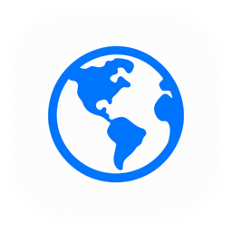
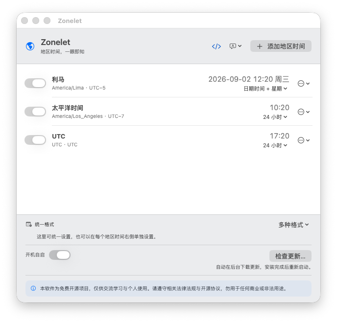

<p align="center">
  
</p>

<h1 align="center">Zonelet</h1>

<p align="center"><strong>地区时间，一眼即知。</strong></p>
<p align="center">小而美的 macOS 菜单栏地区时间工具。</p>

<p align="center">
  <a href="https://github.com/hjingsuper/Zonelet/releases/latest"></a>
  
  
  <a href="https://github.com/hjingsuper/Zonelet/releases/latest/download/Zonelet-Apple-Silicon.dmg"></a>
  <a href="https://github.com/hjingsuper/Zonelet/releases"></a>
  <a href="LICENSE"></a>
</p>

<p align="center">
  <a href="#简体中文">简体中文</a> &nbsp;|&nbsp; <a href="#english">English</a>
</p>

<p align="center">
  <a href="https://hjingsuper.github.io/Zonelet/">官网</a>
  &nbsp;·&nbsp;
  <a href="https://github.com/hjingsuper/Zonelet/releases/latest">下载最新版</a>
  &nbsp;·&nbsp;
  <a href="https://github.com/hjingsuper/Zonelet/issues">问题反馈</a>
</p>

---

<p align="center">
  
</p>

## 简体中文

Zonelet 是一款专注于菜单栏地区时间显示的 macOS 小工具。它使用系统时区数据库换算时间，不需要账户，不收集数据，也没有广告或分析服务。

### 功能

- 在菜单栏同时显示多个地区时间，并自动添加简洁分隔符
- 默认仅添加 UTC，其他地区由用户自行选择
- 显示地区相对本机与 UTC 的精简时差
- 每个地区可独立选择常用预设，或可视化组合年份、月日、分隔符、补零、星期与秒钟
- 支持 `26-9-7 5:3 一` 这样的极简短日期格式，并实时预览菜单栏长度
- 支持统一设置全部地区格式，之后仍可逐项调整
- 拖动手柄自由排序，悬停时显示四向移动光标
- 默认简体中文，可切换 English
- 可选开机自启；后台启动时不弹出主界面
- 支持从 GitHub Releases 检查、下载并安装更新
- 地区时间换算完全本地运行，仅检查更新时连接 GitHub

### 安装

1. 从 [GitHub Releases](https://github.com/hjingsuper/Zonelet/releases/latest) 下载 `Zonelet-Apple-Silicon.dmg`。
2. 打开 DMG，将 Zonelet 拖入“应用程序”文件夹。
3. 在“应用程序”中打开 Zonelet。

> [!IMPORTANT]
> Zonelet 是免费开源项目，目前没有 Apple Developer 证书。如果 macOS 提示无法验证，请前往“系统设置 → 隐私与安全性”，找到被阻止的 Zonelet，点击“仍要打开”。请只从本仓库或官网下载安装包。

如果应用正在运行但菜单栏没有出现，请前往“系统设置 → 菜单栏 → 允许在菜单栏显示”，开启 Zonelet。

### 从源码运行

需要 macOS 14 或更高版本，以及完整 Xcode 或 Xcode Command Line Tools。

```sh
./script/build_and_run.sh
```

运行测试：

```sh
DEVELOPER_DIR=/Applications/Xcode.app/Contents/Developer swift test
```

构建 Apple Silicon DMG：

```sh
python3 -m pip install dmgbuild==1.6.5
ZONELET_CONFIGURATION=release ZONELET_DISTRIBUTION_BUILD=1 ./script/build_and_run.sh --package
./script/package_dmg.sh dist/Zonelet.app Zonelet-Apple-Silicon.dmg
```

### 发布机制

版本号和构建号由根目录的 `VERSION` 与 `BUILD_NUMBER` 管理。推送 `main` 后，GitHub Actions 会按 `VERSION` 自动创建版本标签，执行测试、构建 Apple Silicon DMG、生成 SHA-256 校验文件与 Sparkle `appcast.xml`，然后创建公开 Release。已存在的版本会跳过重复发布。

项目始终使用临时签名，不进行 Apple 公证。Sparkle 更新包通过独立的 EdDSA 签名验证。

## English

Zonelet is a small, focused macOS menu bar app for checking time across regions at a glance. Time-zone conversion uses the macOS system database and runs locally. There are no accounts, analytics, advertisements, or tracking.

### Highlights

- Show multiple regional times in one compact menu bar item
- Start with UTC only and add the locations you need
- See compact offsets from both local time and UTC
- Choose a preset or visually compose date, padding, separators, weekday, and seconds for every location
- Use compact formats such as `26-9-7 5:3 M`, with a live menu bar length preview
- Apply one format globally, then fine-tune individual rows
- Drag to reorder with a clear four-way move cursor
- Simplified Chinese by default, with English available
- Optional launch at login without opening the main window
- Check, download, and install updates from GitHub Releases

### Install

Download `Zonelet-Apple-Silicon.dmg` from the [latest release](https://github.com/hjingsuper/Zonelet/releases/latest), open it, and drag Zonelet to Applications.

> [!IMPORTANT]
> Zonelet does not have an Apple Developer certificate. On first launch, macOS may block the app. Open System Settings → Privacy & Security, find Zonelet, and choose Open Anyway. Only download builds from this repository or the official website.

## License and declaration

Zonelet is open source under the [MIT License](LICENSE). Binary packages include the complete Sparkle and bundled third-party license notices.

本软件为免费开源项目，仅供交流学习与个人使用。请遵守相关法律法规与开源协议，勿用于任何商业或非法用途。

Zonelet is a free and open-source project intended for learning, exchanging ideas, and personal use. Please comply with applicable laws and open-source licenses, and do not use it for commercial or unlawful purposes.
